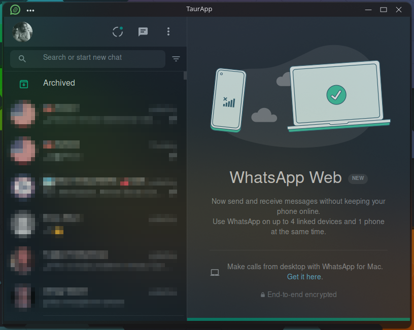

# TauriZapZap

A lightweight WhatsApp desktop client powered by [Tauri](https://tauri.app) and Rust.

TauriZapZap wraps WhatsApp Web in a native window with a small Rust footprint. It's an experimental client, so it might lack some features and be buggy at times.



## Features

- WhatsApp Web in a native desktop window
- Multiple WhatsApp instances
- Native drag-and-drop for attachments
- Download prompt (choose where to save files)
- Minimize to window

## Installing

Head to the [Releases](https://github.com/lucaoskaique/taurizapzap/releases) page, pick the latest version, and download the build for your platform. There's no autoupdate yet, so check the releases page from time to time to grab newer versions.

## Development

Requires [Node.js](https://nodejs.org) and the [Rust toolchain](https://www.rust-lang.org/tools/install) with the [Tauri prerequisites](https://tauri.app/start/prerequisites/).

```bash
npm install
npm run tauri:dev     # run in development
npm run tauri:build   # produce a release build
```

## License

See [LICENSE](LICENSE).
